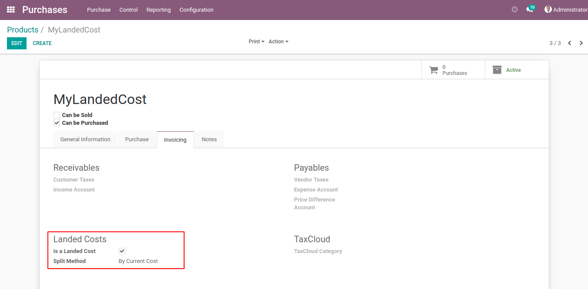
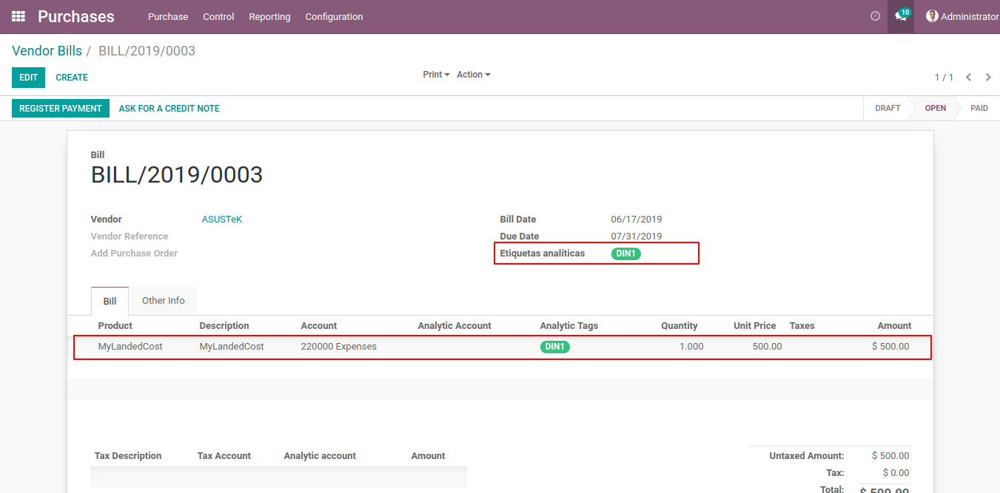
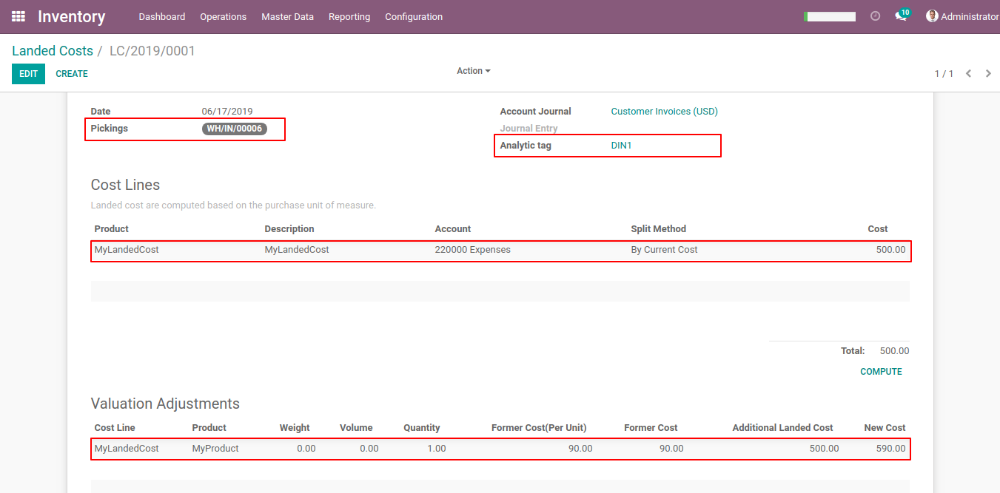

## Landed costs tags

Retrieves the bills on landed costs depending on analityc tags.

### Configuration

- Create the landed cost products to be used.

### Usage

- Create a new Vendor Bill and associte an analityc tag.

- Click on the Generate button after select an analityc tag and a picking to retrieve the bills associted.

